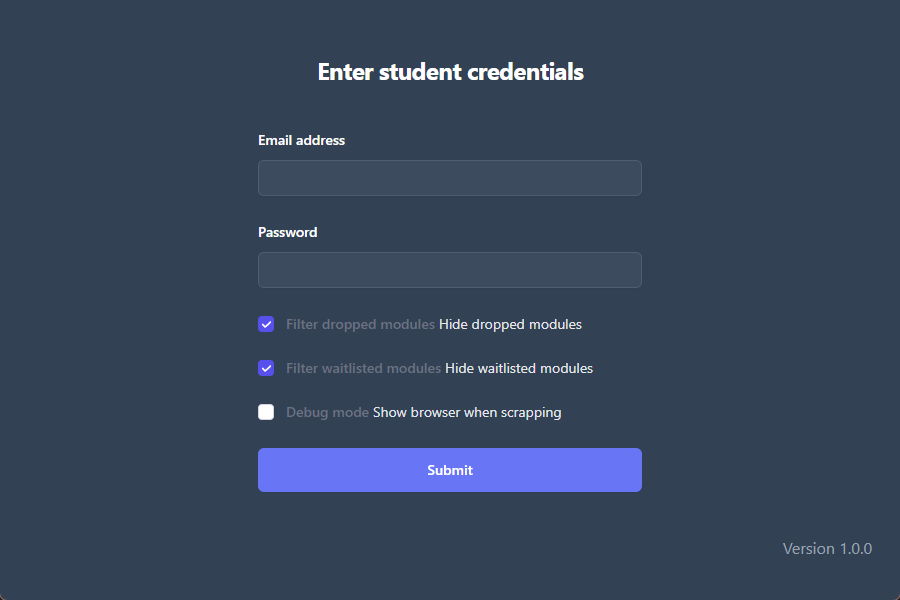
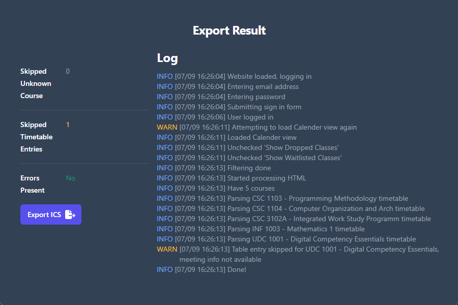

# Export SIT Timetables

This program scraps the in4SIT website for your timetable. Exporting it to an ICS file which can then be imported to a calendar app.


## Features

- Simple interface, easy to use
- Great error handling, user will know if something went wrong during export



## Installation

Use the binaries released for Windows or you can build it from source

## Build steps
Install nodeJS \
Install Rust
```shell
npm install
cargo install tauri-cli --version "^2.0.0-rc"
cargo tauri build
```
Executables can be found in /src-tauri/target/release

## Contributing

Contributions are welcome!
\
Feel free to open a pull request or an issue on the GitHub repository.
\
I think the UI can be improved.


## License

This project is licensed under the GNU General Public License v3.0.
